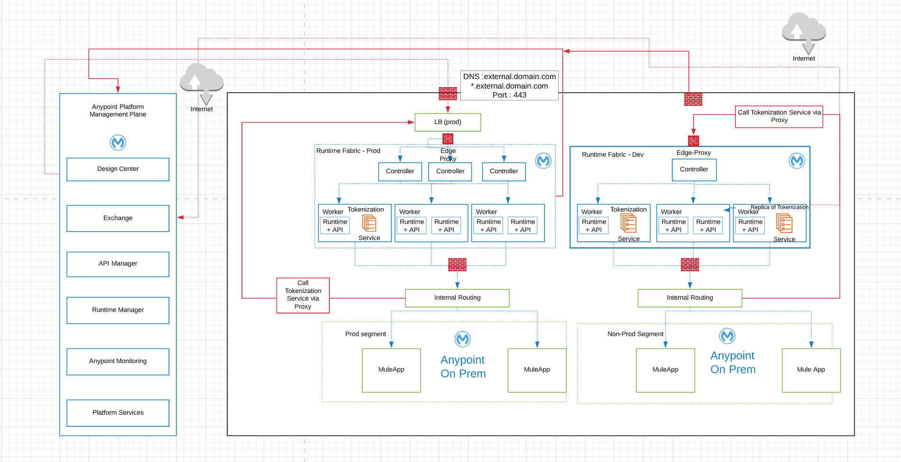

# mule4-tokenization-service-template

Prerequisites for Tokenization 
RunTime Fabric is a prerequisite for Tokenization . 

The way you configure and use the tokenization service depends on your Mule implementation:

Apply as a Tokenization policy on the API Gateway .

Expose Tokenization as Service to Mule Applications directly .

Tokenization Service Architecture :

UseCase 1 : Expose Tokenization as a Service to Mule App on -Prem 

Example :

Call Tokenization Proxy : POST htttps://tokenization-proxy.external.domain.com:443/AnyPointTokenization/v1/tokenize -H 'Content-Type:application/json' -d '[{"format: "CC" : "3799-6895-4977-162"}]'


Tokenization Configuration 
To configure and use the tokenization service, you need:

 1. Runtime Fabric 

 2. A secret group 

 3. A tokenization format

